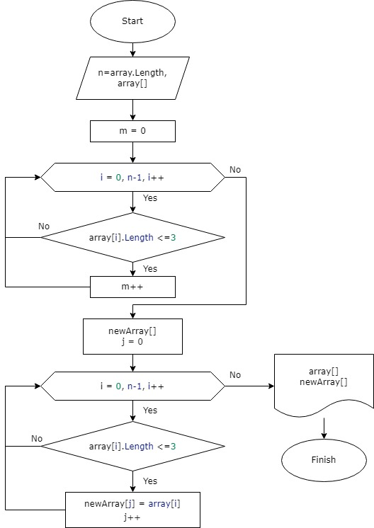

# Итоговая проверочная работа
## Задача

1. Создать репозиторий на GitHub
2. Нарисовать блок-схему алгоритма (можно обойтись блок-схемой основной содержательной части, если вы выделяете её в отдельный метод)
3. Снабдить репозиторий оформленным текстовым описанием решения (файл README.md)
4. Написать программу, решающую поставленную задачу
5. Использовать контроль версий в работе над этим небольшим проектом (не должно быть так, что всё залито одним коммитом, как минимум этапы 2, 3, и 4 должны быть расположены в разных коммитах)

## Решение
1. Ссылка на репозиторий https://github.com/Nadegdawk/Final_Work.git
2. Создаем алгоритм работы программы.

3. Принцип работы программы.

    3.1. Пользователь вводит длину массива ипоследовательно заполняет его данными.

    3.2. В первом цикле проверяется сколько в пользовательском массиве элементов с длиной символов не более трех, на основе полученного количества создается массив нужного размера.

    3.3. Во втором цикле новый массив заполняется только теми элементами из исходного массива, длина которых не более трех символов.

    3.4. Далее выводятся в консоль исходный пользовательский массив и массив, полученный в результате работы программы.

4. Алгоритм, программа и описание загружено на репозиторий.
